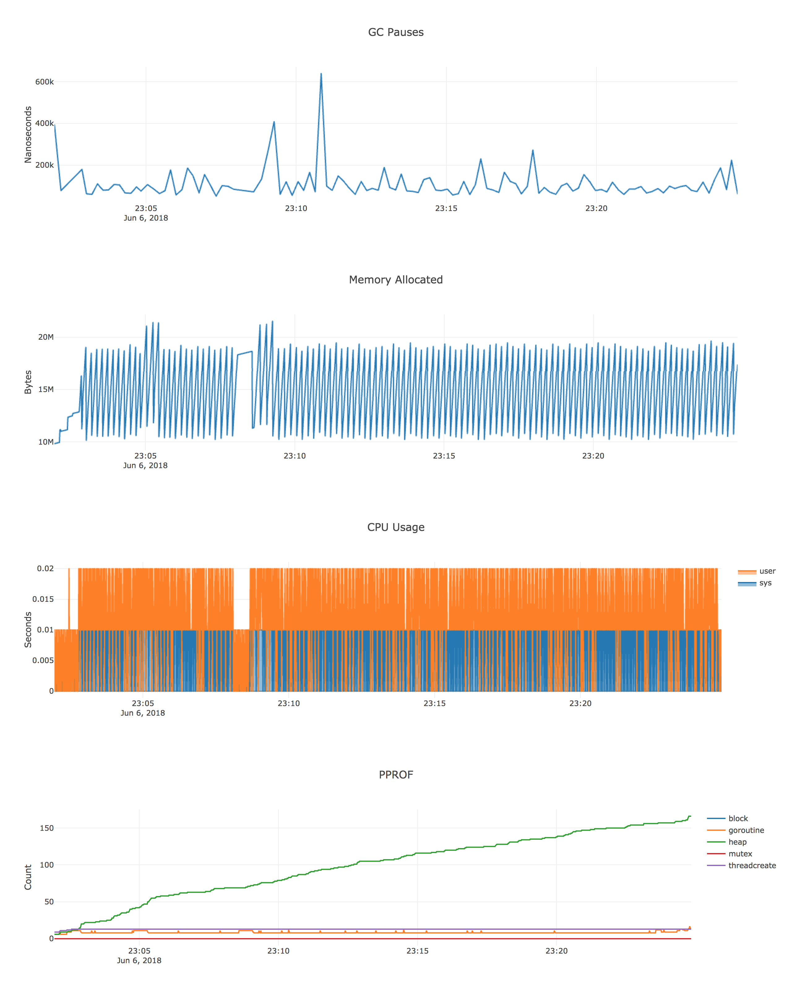
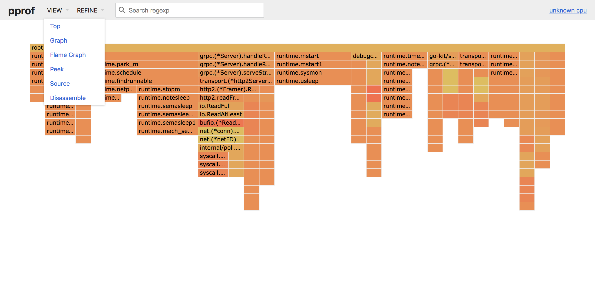
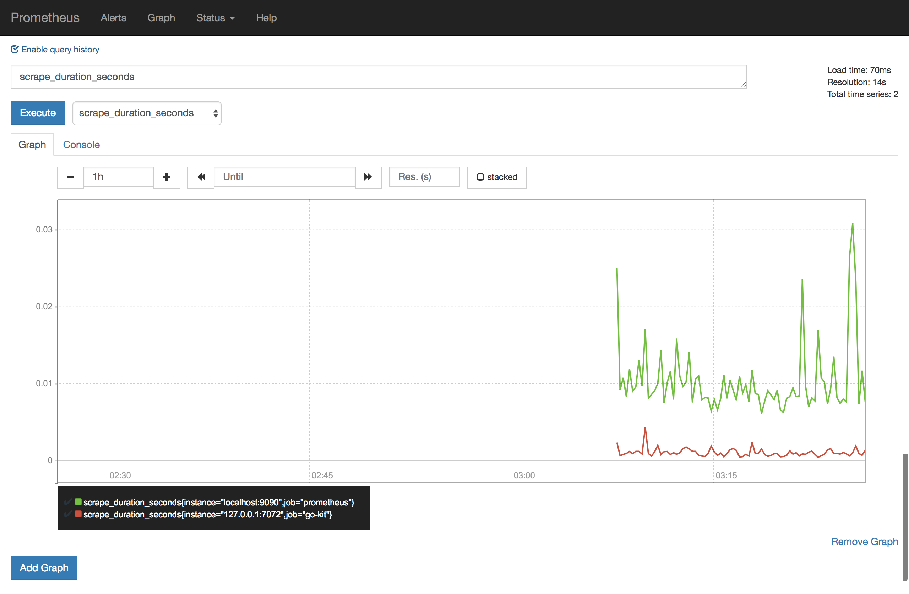

# SURLS (For Demo)

> 使用[go-kit](https://github.com/go-kit/kit)搭建，集成常用组件
- [x] 依赖库管理 [glide](https://github.com/Masterminds/glide)
- [x] 实时编译 [realize](https://github.com/oxequa/realize)
- [x] 命令行支持 [cli](https://github.com/urfave/cli)
- [x] [grpc](https://github.com/grpc/grpc)支持 
- [x] grpc => http [协议自动转换](https://github.com/grpc-ecosystem/grpc-gateway)
- [x] 服务熔断[hystrix](https://github.com/afex/hystrix-go) 
- [x] prometheus采集支持
- [x] docker镜像构建
- [x] 自定义中间件
- [x] 实时debug图表信息 [debugcharts](https://github.com/mkevac/debugcharts)
- [x] pprof分析器，图表化
- [x] 多平台打包[gox](https://github.com/mitchellh/gox)
- [x] 服务优雅退出 graceful
- [x] tests
- [x] benchmark
- [ ] zipkin全链路追踪

## 环境依赖 (go1.10.2)
```bash
# docker环境
$ curl -fsSL https://get.docker.com/ | sh

# glide
$ brew install glide

# realize
$ go get -v github.com/oxequa/realize

# gox
$ go get -v github.com/mitchellh/gox

# protobuf
$ brew install protobuf
$ go get -u -v github.com/golang/protobuf/protoc-gen-go

# grpc-gateway
$ go get -u -v github.com/grpc-ecosystem/grpc-gateway/protoc-gen-grpc-gateway
$ go get -u -v github.com/grpc-ecosystem/grpc-gateway/protoc-gen-swagger

# pprof
$ brew install graphviz
$ go get -u -v github.com/google/pprof
```

## 文件目录结构
```
.
├── assets //公共资源
├── bin //go build后bin包
├── cli //命令行参数解析
├── clients //grpc客户端
|   ├── count //count服务客户端
|   └── upper //upper服务客户端
├── docker //docker镜像构建相关
├── global //全局生效 变量&配置
├── lib //公共库目录
├── utils //工具目录
├── pb //protobuf 相关文件保存目录
├── servers //服务启动相关
├── svc //服务业务逻辑相关目录
|   └── surlssvc //string服务业务逻辑
|       ├── endpoints //go-kit endpoints
|       ├── interfaces //定义服务部分
|       ├── transports //go-kit transport
|       ├── middlewares //go-kit middleware
|       |   ├── mw_endpoint //go-kit endpoint类型中间件
|       |   └── mw_svc //go-kit svc类型中间件
|       └── svc.go //实现定义的服务
├── tests //单元测试保存目录
├── vendor //依赖库保存目录
├── .realize.yaml //实时自动编译配置文件
├── glide.yaml //依赖库配置文件
├── pid //项目启动pid记录文件
└── ... //其他配置文件

```

## Run
```bash
$ cd $GOPATH/src/go-kit
# 自动编译
$ realize start
# 手动启动
$ go run main.go -h 
# 验证服务
# 访问 grpc server
$ go run clients/upper/client.go -s test
$ go run clients/count/client.go -s test
# 访问 http server
$ curl -XPOST -d '{"s":"test"}' http://localhost:7071/v1/upper
$ curl -XPOST -d '{"s":"test"}' http://localhost:7071/v1/count
```

## Graceful
```bash
# 测试优雅退出可以在代码中增加sleep进行测试
$ cat $GOPATH/src/go-kit/pid | xargs kill -s SIGINT
```

## Build
```bash
$ gox -verbose
```

## Test
```bash
$ cd $GOPATH/src/go-kit/tests
$ go test -v
-----------------------------------------------
=== RUN   TestStringSvcGrpcServiceCount
--- PASS: TestStringSvcGrpcServiceCount (0.00s)
=== RUN   TestStringSvcGrpcServiceUpper
--- PASS: TestStringSvcGrpcServiceUpper (0.00s)
PASS
ok  	go-kit/tests	0.024s

```

## Benchmark
```bash
$ cd $GOPATH/src/go-kit/tests
$ go test -bench=. -benchtime=2s -benchmem -run=none -v
----------------------------------------------------------------------------------------------------
goos: darwin
goarch: amd64
pkg: go-kit/tests
BenchmarkStringSvcGrpcServiceCount-4   	 1000000	      2656 ns/op	    1408 B/op	      18 allocs/op
BenchmarkStringSvcGrpcServiceUpper-4   	  100000	     29235 ns/op	    2471 B/op	      40 allocs/op
PASS
ok  	go-kit/tests	5.938s
```

## Docker Build
```bash
$ cd $GOPATH/src/go-kit
$ docker build -f docker/image_build/Dockerfile ../ -t=go-kit-demo
$ docker run -d \
--name go-kit-demo \
-p 7070:7070 \
-p 7071:7071 \
-p 7072:7072 \
-p 7073:7073 \
go-kit-demo
```

## Debug
```bash
# debug默认端口为7073,
$ debugUrl=http://localhost:7073
```
>实时图表化数据
```bash
$ open $debugUrl/debug/charts/
```


>常规debug信息
```bash
$ open $debugUrl/debug/pprof/
$ open $debugUrl/debug/pprof/cmdline
$ open $debugUrl/debug/pprof/profile
$ open $debugUrl/debug/pprof/symbol
$ open $debugUrl/debug/pprof/trace
```

>采集数据,展示分析结果
```bash
$ go test -bench=. -benchtime=3s -benchmem -run=none -v &
$ pprof -web $debugUrl/debug/pprof/profile
# Saved profile in /path/to/pprof.xx.pb.gz`
```

```bash
# 原生pprof，比go tool pprof分析结果更加丰富
$ pprof -http=:7074 /path/to/pprof.xx.pb.gz
$ open http://localhost:7074
```


>Prometheus 数据采集
```bash
# 启动prometheus
$ docker run -d \
  --rm \
  -p 9090:9090 \
  --name prometheus \
  --network=host \
  -v $GOPATH/src/go-kit/docker/prometheus/data:/prometheus-data \
  prom/prometheus \
  --config.file=/prometheus-data/prometheus.yml

$ open http://127.0.0.1:9090
```

